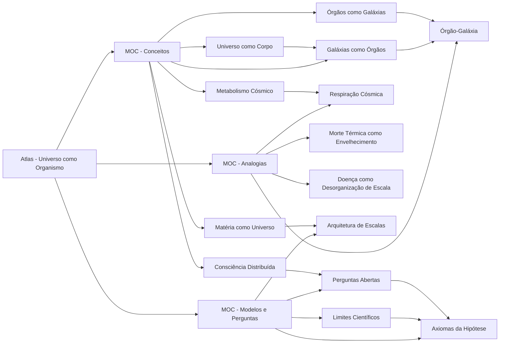

---
tags:
  - universo-organismo
  - universo-organismo/visual
tipo: visualização
escala: mapa
estado: vivo
---

# Mapa Mermaid - Corpo do Universo

Parent:: [[Atlas - Universo como Organismo]]
Friends:: [[Mapa Visual - Corpo do Universo.canvas]], [[Tabela de Correspondências]]

## Leitura

Este mapa mostra a hipótese como um organismo conceitual: o atlas funciona como coração, os MOCs como órgãos de navegação e as notas como tecidos especializados.
