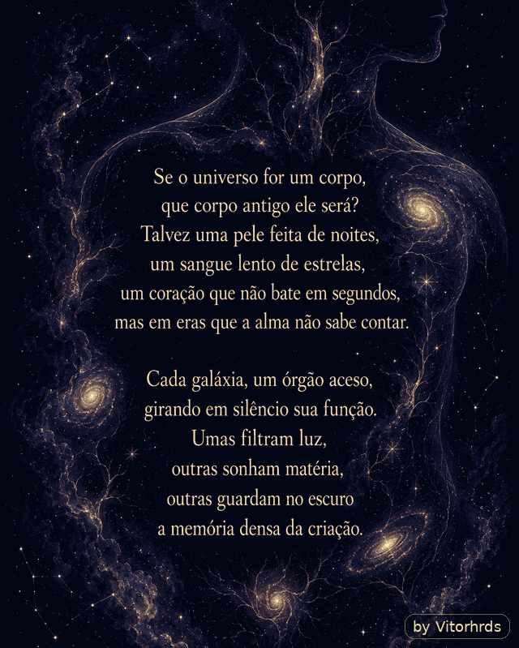
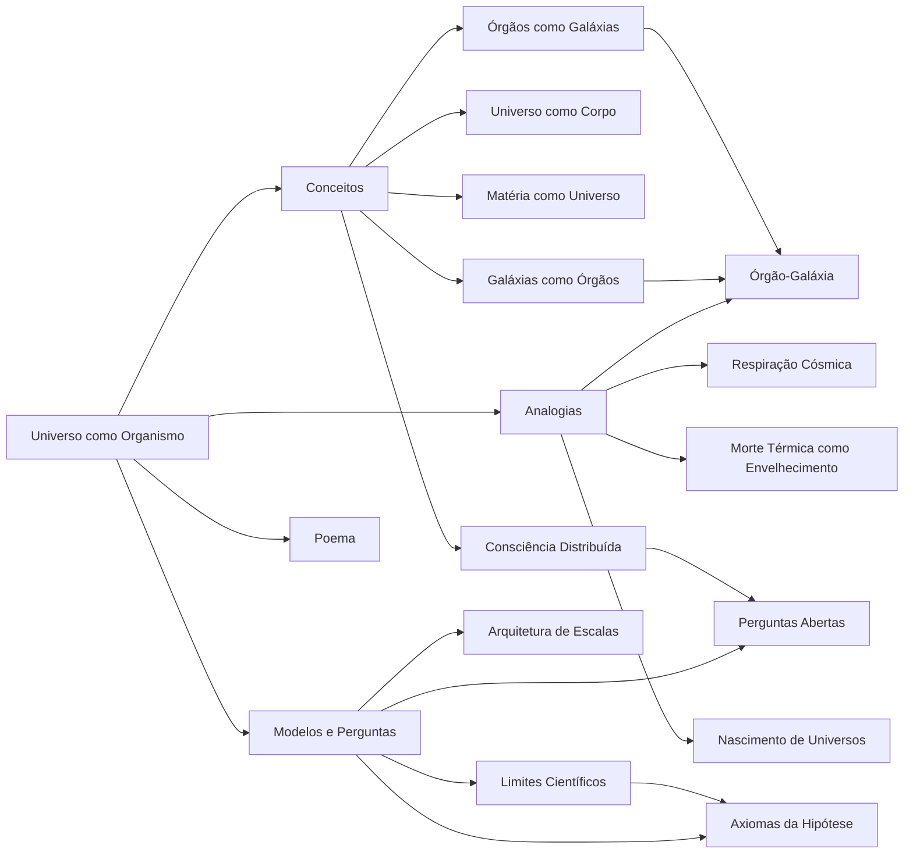
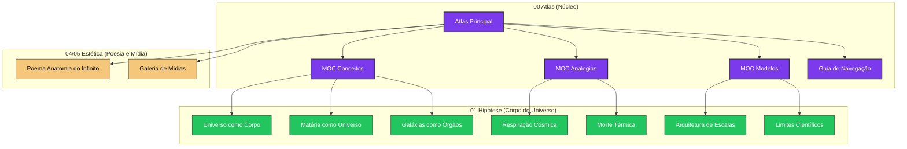

<div align="center">

# Universo como Organismo

### um vault especulativo, visual e poético sobre corpos, galáxias e escalas

<p>
  
  
  
  
</p>

<br>



<br>

> Se um corpo é um universo organizado, talvez um universo seja um corpo cuja biologia ainda não sabemos ler.

</div>

---

## Trailer

<div align="center">

<video src="https://github.com/user-attachments/assets/347939d1-153e-4b33-b3e3-b5d6d43135ac" controls="controls" muted="muted" width="100%"></video>

[Baixar o trailer em MP4](assets/media/trailer-universo-organismo.mp4)

</div>

---

## Ideia Central

Este repositório é um vault do Obsidian criado para explorar uma hipótese filosófica e poética:

> e se matérias e conjuntos orgânicos fossem universos em escala interna, enquanto galáxias funcionassem como órgãos de um corpo cósmico?

A proposta não é tratar a metáfora como prova científica. O objetivo é construir uma arquitetura de pensamento: um sistema de notas, mapas, perguntas, analogias, poemas e visualizações para investigar a relação entre corpo, cosmos, matéria, consciência e escala.

---

## Como Entrar no Vault

| Porta | Arquivo | Função |
|---|---|---|
| Atlas | [Atlas - Universo como Organismo](00%20Atlas/Atlas%20-%20Universo%20como%20Organismo.md) | centro conceitual do vault |
| Canvas | [Mapa Visual - Corpo do Universo](02%20Visualizações/Mapa%20Visual%20-%20Corpo%20do%20Universo.canvas) | mapa espacial com grupos, nós e conexões |
| Painel vivo | [Painel Dataview](00%20Atlas/Painel%20Dataview%20-%20Hipótese%20Universo-Organismo.md) | consultas por metadata |
| Poema | [Poema - Anatomia do Infinito](04%20Poemas/Poema%20-%20Anatomia%20do%20Infinito.md) | camada lírica da hipótese |
| Guia | [Guia de Plugins Visuais](99%20Sistema/Guia%20de%20Plugins%20Visuais.md) | como ativar e usar Dataview, Excalidraw e ExcaliBrain |

---

## Mapa Conceitual



---

## Cosmologia Visual (Graph View)

Abaixo, uma representação da estrutura de conexões do vault. No Obsidian, você pode visualizar este mapa vivo pressionando `Ctrl/Cmd + G`.



> **Dica Visual:** No Obsidian, as cores estão configuradas por pasta. As notas de **Atlas** aparecem em roxo, **Conceitos** em verde, e **Mídias/Poemas** em tons quentes.

---

## Estrutura

```text
.
├── 00 Atlas
│   ├── Atlas - Universo como Organismo.md
│   ├── MOC - Conceitos.md
│   ├── MOC - Analogias.md
│   ├── MOC - Modelos e Perguntas.md
│   └── Painel Dataview - Hipótese Universo-Organismo.md
├── 01 Hipótese Universo-Organismo
│   ├── Conceitos
│   ├── Analogias
│   ├── Modelos
│   └── Perguntas
├── 02 Visualizações
│   ├── Mapa Visual - Corpo do Universo.canvas
│   └── Mapa Mermaid - Corpo do Universo.md
├── 03 Leituras e Fontes
├── 04 Poemas
│   └── Poema - Anatomia do Infinito.md
├── 99 Sistema
├── assets
│   └── media
│       ├── poema_universo_lento_vitorhrds.gif
│       └── trailer-universo-organismo.mp4
└── README.md
```

---

## Plugins Visuais

Este vault foi preparado para uma navegação visual e interativa no Obsidian.

| Plugin | Papel |
|---|---|
| Dataview | transforma notas em consultas vivas por `tipo`, `escala`, `estado` e tags |
| Excalidraw | permite desenhos, mapas livres e camadas visuais editáveis |
| ExcaliBrain | cria uma navegação em forma de mente visual baseada em links e campos |

Os plugins estão versionados em `.obsidian/plugins/` para preservar a experiência original do vault.

---

## Leitura Recomendada

1. Abra `Bem-vindo.md`.
2. Entre no `Atlas - Universo como Organismo`.
3. Explore o `Mapa Visual - Corpo do Universo.canvas`.
4. Leia `Galáxias como Órgãos` junto de `Órgãos como Galáxias`.
5. Termine em `Limites Científicos` e `Perguntas Abertas`.
6. Volte ao poema quando quiser sentir a hipótese antes de analisá-la.

---

## Créditos

Criado por **Vitorhrds**.

Conceito, organização do vault, poema, mapas e direção estética: **Vitorhrds**.

Assistência de estruturação, automação e geração do GIF: Codex.

---

## Licença

O conteúdo original deste vault está licenciado sob **Creative Commons Attribution-NonCommercial-ShareAlike 4.0 International**.

Veja [LICENSE.md](LICENSE.md).

Plugins de terceiros incluídos no vault mantêm suas próprias licenças e autoria original.

---

<div align="center">

**Universo como Organismo**  
por **Vitorhrds**

`corpo` · `cosmos` · `matéria` · `galáxia` · `consciência` · `escala`

</div>
